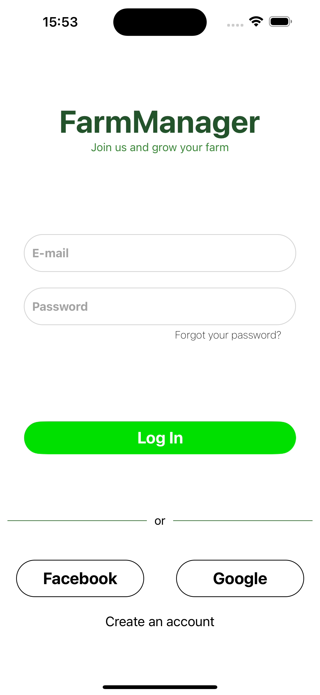
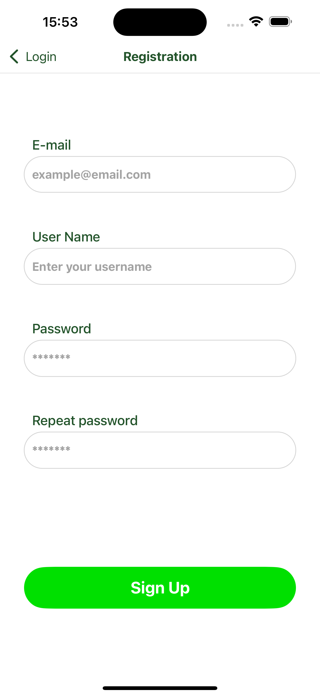
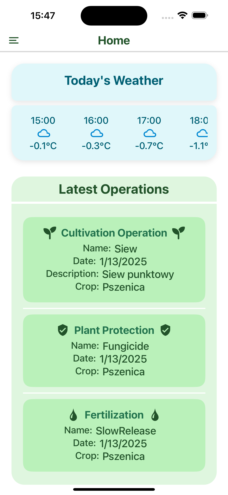
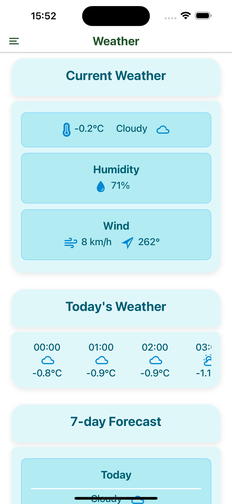
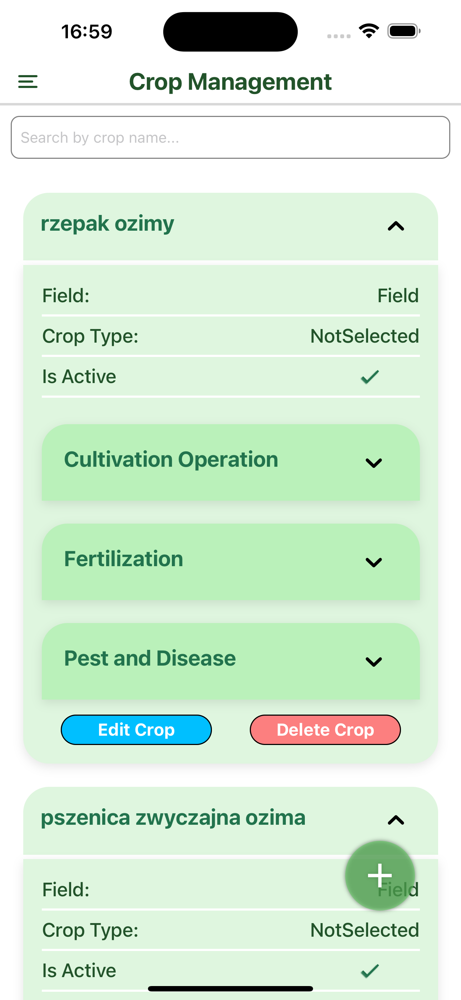

# FarmManager Mobile – React Native Application

## 📌 Project Description

FarmManager Mobile is a **React Native** application designed to help farmers efficiently manage their farms, fields, and crops. It provides a **user-friendly interface** that interacts with the **FarmManager API** (https://github.com/baarteek/FarmManagerAPI), allowing users to monitor agrotechnical operations, view weather updates, manage reports, and track cultivation activities directly from their mobile devices.

The application integrates **map-based functionalities**, **crop and field tracking**, and **report generation**, ensuring seamless farm management on the go. 🌱🚜

---

## ⚡ Features

### 🏠 1. Home Dashboard
- Displays **latest operations** on the farm.
- Shows **current weather conditions** and forecasts.

### 🌾 2. Farm and Field Management
- Allows users to **view, edit, and manage farms and fields**.
- Displays field locations on an **interactive map**.
- Supports switching between **standard and satellite map views**.

### 🌱 3. Crop Management
- Enables **adding, editing, and deleting crops**.
- Displays crop details with a **history of operations**.
- Supports **fertilization, plant protection, and cultivation tracking**.

### 📂 4. Data and Reports
- Users can **download reports** in **PDF and Excel formats**.
- Displays detailed agrotechnical intervention reports.

### 🗺️ 5. Map Features
- **Displays farm and field boundaries** on a map.
- Allows **distance and area measurement** directly from selected map points.
- Supports **user location tracking**.

### 🔄 6. Data Synchronization
- Fetches **real-time data** from the **FarmManagerAPI**.

### ✅ 7. User Authentication
- Supports **login, registration, and password reset**.
- Secure **user authentication**.

### 🔢 8. Calculators for Farmers
- Includes **grain yield, seeding rate, fertilization, and crop protection calculators**.

---

## 🚀 Technologies Used
- **React Native** – Mobile framework for cross-platform development.
- **Expo** – Simplified development and deployment.
- **React Navigation** – Navigation management.
- **Axios** – API requests.

---

## 🛠️ Installation & Setup

### 📌 Prerequisites
- **Node.js** (Latest LTS version recommended)
- **Expo CLI** installed globally
- **FarmManagerAPI** credentials (https://github.com/baarteek/FarmManagerAPI)
  
### 🔧 Steps to Run the Application

1. **Clone the Repository:**
   ```bash
   git clone https://github.com/baarteek/FarmManager
   cd FarmManager
   ```

2. **Install Dependencies:**
   ```bash
   npm install
   ```

3. **Run the Application:**
   ```bash
   expo start
   ```

4. **Test on Mobile:**
   - Scan the QR code with **Expo Go** (Android/iOS) to preview the app.

---

## 🖼️ Screenshots

<p align="center">
  
  
</p>

<p align="center">
  
  
</p>

<p align="center">
  
  
</p>

Screenshots are stored in the `docs/` directory.

---

## 🚨 Project Status

🚨 **This project was developed as part of a farm management system and is actively maintained.** 🚨

